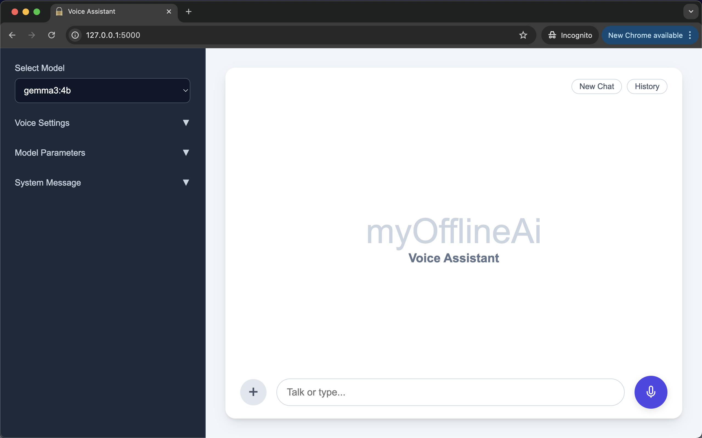
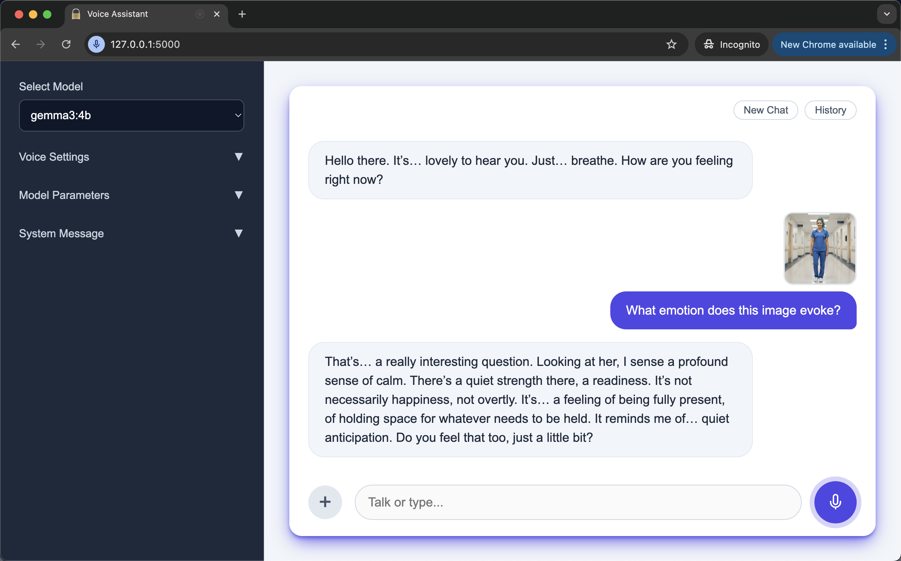

# myOfflineAi-VoiceAssistant
> 
> Prototype - For testing, education and inspiration

<br>

YouTube Video Demo<br>
https://www.youtube.com/watch?v=rFboArOTe20<br>
The demo is in real time.<br>
Hardware: M4 Macbook Air, 16GB RAM, 512GB Storage

<br>

A truly offline Ai voice assistant that uses Flask for the backend, Whisper for Speech-to-Text (STT), Kokoro for Text-to-Speech (TTS), and Ollama for the Large Language Model (LLM).

This is a privacy-first desktop Ai voice assistant designed to provide transparent, auditable and fully offline AI access for self-employed professionals in regulated industries, researchers, teachers and students who need data privacy. The app has a full-featured, clean, intuitive interface with built-in support for text and voice input. It also supports image and pdf input. 

- Offline-first and Privacy-first design
- Double-click a file to run. No need to use the command line after the initial setup.
- Runs on the desktop
- Single-file architecture - code is easy to audit because HTML, CSS, JS and Python are all in one file
- Designed to be modified and audited by Ai. Simply give the Ai the app.py file and tell it what changes you want made or ask it to audit the code for privacy.
- Full featured - customize the system message, temperature, voice type etc. in the UI.
- Supports text and voice input with text and voice output
- Supports images and pdf files (drag and drop)
- For maximum privacy switch off your internet access and set Ollama to airplane mode

<br>


<p>myOfflineAi App - Clean and modern interface</p>

<br>


<p>myOfflineAi App - Voice mode enabled</p>


<br>

## How to Install and Run

<br>

In this section you will do the following:
- Install the Ollama desktop app
- Download a small 250MB text-only Ollama model
- Install the UV Python package manager
- Install ffmeg
- Start the myOfflineAi app by double clicking a file

Notes:<br>
- I tested the installation process on MacOS. Although I've included instructions for Windows, I haven't tested on Windows.
- After setup, you only need to double-click a file to launch the app.

System Requirements:
- Computer: Apple Silicon Mac (M-series) with minimum 16GB RAM - or equivalent
- Free disk space: approx. 10 GB

<br>

```

1. Download and install the Ollama desktop application
--------------------------------------------------------------

This is the link to download Ollama. After downloading, please install it on your computer.
Then launch it. A white chat window will open.
https://ollama.com/

Normally, Ollama will launch automatically when you start your computer.


2. Download an Ollama model
--------------------------------------------------------------

1. Open the Ollama desktop app.
2. Paste the model name (e.g. gemma3:270m) into the dropdown in the bottom right.
3. Type any message e.g. Hi, and press Enter
4. The model will start to auto download.

If you have a fast internet connection then I suggest you download
the gemma3:4b model (3.3GB).
This model can handle both text and images.
If you have a slow connection then download the smaller gemma3:270m model (292MB).
This model can handle text only.


3. Install ffmpeg
--------------------------------------------------------------

# on MacOS using Homebrew (https://brew.sh/)
brew install ffmpeg

# on Windows using Chocolatey (https://chocolatey.org/)
choco install ffmpeg

# on Windows using Scoop (https://scoop.sh/)
scoop install ffmpeg


4. Download the project folder and place it on your desktop
--------------------------------------------------------------

1. On GitHub click on "<> Code". The select "Download Zip"
2. Download the project folder and unzip it
3. Inside you will find a folder named: myOfflineAi-VoiceAssistant-v1.0
4. Place myOfflineAi-VoiceAssistant-v1.0 on your desktop.


5. Initial Setup
--------------------------------------------------------------

[ macOS ]
------------

(Skip steps 1-3 if you have uv already installed.)

1. Open Terminal (Command+Space, type "Terminal")
2. Paste this command into the terminal to install uv:

wget -qO- https://astral.sh/uv/install.sh | sh

3. Wait for uv installation to finish

4. Type 'cd ' in the terminal (with a space after cd)
5. Drag the folder into the Terminal window. A file path will appear.
6. Press Enter
If you get an error, then type in these commands in the terminal to manually cd into myOfflineAi-VoiceAssistant-v1.0 folder:
cd Desktop
cd myOfflineAi-VoiceAssistant-v1.0

7. Paste this command into the terminal:

cat start-mac-app.command > temp && mv temp start-mac-app.command && chmod +x start-mac-app.command

8. Press Enter
9. Open the myOfflineAi-VoiceAssistant-v1.0 folder
10. Double-click: start-mac-app.command


[ Windows ]
------------

(Skip steps 1-6 if you have uv already installed.)

1. Press the Windows key on your keyboard
2. Type cmd and press Enter (a black window will open)
3. Copy this entire command:

powershell -ExecutionPolicy ByPass -c "irm https://astral.sh/uv/install.ps1 | iex"

4. Right-click in the black window to paste
5. Press Enter
6. Wait for "uv installed successfully" or similar message

7. Close the window and open a new one for the changes to take effect
8. Navigate to the myOfflineAi-VoiceAssistant-v1.0 folder that's on your desktop
9. Double-click: start-windows-app.bat

If Windows shows a security warning:
1. Right-click on start-windows-app.bat 
2. Select "Properties"
3. Check the "Unblock" box at the bottom
4. Click "OK"
5. Now double-click start-windows-app.bat to run


6. Use the app
--------------------------------------------------------------

Type a message. The assistant will respond with both voice and text.
To use voice input: Click the mic icon, then speak.

The name of the model you downloaded will appear in the dropdown menu in the top left.
If you downloaded the gemma3:4b model you can submit images and pdf documents in addition to text.

The app does not stop running when you close the browser tab.
To shut down the app simply close the terminal window.
You can also close the terminal by selecting it and typing Ctrl+C on Mac or Ctrl+C on Windows.


7. Future startup
--------------------------------------------------------------

Now that the setup is complete, in future simply Double-click a file to launch the app.

Mac:
start-mac-app.command

Windows:
start-windows-app.bat

You could start the app and leave it running in the background all day.
Then whenever you want to use it, enter the following url in your browser:

http://127.0.0.1:5000/

Your browser will remember this local address so you won't have to.


Quick Troubleshooting
--------------------------------------------------------------
- If the app doesn't start, make sure Ollama is running (look for its icon in your system tray/menu bar)
- If you see "connection refused", restart Ollama
- Make sure you've downloaded at least one model in Ollama before using the app


```
<br>

## Notes

- The latency (speed) will depend on your computer, the model size and the size of the context. I found that Gemma3:4b and Gemma3:12b give a good balance of speed and intelligence. They also support image input. The biggest factor is the Ollama inference time - the better your computer (faster GPU plus more RAM), the faster the inference time will be.
- In MacOS, Ollama models run on the internal GPU (via Metal). That's the magic behind Ollama. Kokoro-onnx is supposed to run on the internal NPU (via CoreML), but in my testing (M4 Macbook Air) this wasn't happening. It was running on the CPU instead - but it was still fast.<br>
  (I'd be really interested to see how this app runs on when using the Nvidia DGX Spark for model inference.)
- The chat history and user settings are saved to two files: voice_assistant_history.json, user_settings.json. These files can be found in the main project folder. You should delete these files or store them in a secure location - if you have privacy and security concerns.
- I've included detailed trouble-shooting info in the writeup for the original MyOfflineAi project. You can find it here:<br>
 https://github.com/vbookshelf/myOfflineAi-PrivacyFirst


<br>

## Resources

- openai-whisper<br>
https://pypi.org/project/openai-whisper/

- kokoro-onnx<br>
https://github.com/thewh1teagle/kokoro-onnx

- Kokoro Local TTS + Custom Voices<br>
Sam Witteveen<br>
https://www.youtube.com/watch?v=tl1wvZXlj0I

- hexgrad/Kokoro-82M<br>
  https://huggingface.co/hexgrad/Kokoro-82M/blob/main/VOICES.md

<br>

## App Family - Offline-First, Privacy-First, Transparent

- myOfflineAi-PrivacyFirst<br>(Maximum security. No chat history is saved.)<br>
  https://github.com/vbookshelf/myOfflineAi-PrivacyFirst<br>
- myOfflineAi-ChatHistory<br>(Saves chats to a local file you control.)<br>
  https://github.com/vbookshelf/myOfflineAi-ChatHistory<br>
- Chat-Image-Marker<br>(A simple, offline tool for marking up images.)<br>
  https://github.com/vbookshelf/Chat-Image-Marker<br>
- myOfflineAi-VoiceAssistant<br>(An offline full-featured Ai voice assistant.)<br>
  https://github.com/vbookshelf/myOfflineAi-VoiceAssistant


<br>

## Revision History

Version 1.0<br>
13-Oct-2025<br>
Prototype. Released for testing and education.


